# Предложение: AST-chunking для BSL (1С) в QMD

**Статус:** черновик для обсуждения  
**Автор:** —  
**Дата:** 2026-06-03  
**Аудитория:** архитектор / maintainers QMD  
**Связанные компоненты:** `src/ast.ts`, `src/store.ts`, `qmd embed`, `qmd query`

---

## 1. Контекст

QMD индексирует коллекции документов (в т.ч. конфигурации 1С: `.bsl`, `.md`, иногда `.xml`) и строит гибридный поиск: FTS + векторы + rerank. Качество векторного поиска по коду сильно зависит от **границ чанков**: при режиме `regex` (по умолчанию) процедуры и функции BSL часто **разрезаются посередине**, что ухудшает recall и rerank.

Уже реализован **AST-aware chunking** (`--chunk-strategy auto`) на базе [web-tree-sitter](https://github.com/tree-sitter/tree-sitter) для TS/JS, Python, Go, Rust. BSL в список языков **не входит**; файлы `.bsl` обрабатываются как обычный текст с markdown-подобными break points (заголовки, пустые строки), что для BSL почти бесполезно.

Сообщество 1С: существует зрелая грамматика [alkoleft/tree-sitter-bsl](https://github.com/alkoleft/tree-sitter-bsl) (npm `tree-sitter-bsl`, MIT), с WASM-сборкой и corpus-тестами. Это естественный кандидат для расширения существующего механизма, **без новой подсистемы**.

---

## 2. Цели и не-цели

### Цели

| # | Цель |
|---|------|
| G1 | При `--chunk-strategy auto` резать `.bsl` / `.osl` по границам `procedure_definition`, `function_definition` (и при необходимости областей/объявлений переменных). |
| G2 | Сохранить текущий контракт: opt-in, graceful fallback на `regex`, без изменения поведения по умолчанию. |
| G3 | Вписаться в существующую архитектуру `ast.ts` + optionalDependencies (как Go/Rust). |
| G4 | Покрыть интеграционными тестами и отображением в `qmd status`. |

### Не-цели (первая итерация)

| # | Исключено |
|---|-----------|
| NG1 | Парсинг/чанкинг **SDBL** (`.sdbl`, встроенные запросы в строках BSL) — отдельная грамматика, отдельное решение. |
| NG2 | AST для **XML метаданных** 1С (`Form.xml`, отчёты) — другой формат, другой парсер. |
| NG3 | Семантический анализ 1С (контекст выполнения, типы платформы). |
| NG4 | Включение `auto` по умолчанию для всех пользователей. |
| NG5 | Публикация/форк грамматики внутри org — используем upstream npm, не vendoring без необходимости. |

---

## 3. Текущая архитектура (кратко)

```mermaid
flowchart LR
  subgraph embed["qmd embed"]
    E1[chunkDocumentByTokens]
  end
  subgraph query["qmd query"]
    Q1[chunkDocumentAsync для rerank]
  end
  subgraph ast["src/ast.ts"]
    A1[detectLanguage]
    A2[loadGrammar WASM]
    A3[getASTBreakPoints]
    A4[mergeBreakPoints + regex]
  end
  E1 --> A3
  Q1 --> A3
  A1 --> A2 --> A3 --> A4
```



- **Runtime:** `web-tree-sitter@0.26.7`, динамический import, один init на процесс.
- **Грамматики:** optional npm-пакеты; путь к `.wasm` через `createRequire` + `require.resolve`.
- **Точки разреза:** Tree-sitter Query → `BreakPoint[]` → merge с regex → общий `chunkDocumentWithBreakPoints`.
- **Индексация (`qmd update`):** документ целиком в FTS; AST влияет только на **embed** и **query** (выбор чанка кандидата).

Расширение BSL = **локальное изменение** в `ast.ts` + dependency + тесты + документация.

---

## 4. Предлагаемое решение

### 4.1 Зависимость

Добавить в `optionalDependencies`:

```json
"tree-sitter-bsl": "0.1.7"
```

WASM из пакета (по `package.json` upstream): `grammars/bsl/tree-sitter-bsl.wasm`.  
Путь резолвится так же, как для `tree-sitter-python`:

```ts
bsl: { pkg: "tree-sitter-bsl", wasm: "grammars/bsl/tree-sitter-bsl.wasm" }
```

### 4.2 Детекция языка

| Расширение | Язык |
|------------|------|
| `.bsl` | `bsl` |
| `.osl` | `bsl` (OneScript — та же грамматика upstream) |

### 4.3 Query для break points (черновик)

Узлы из [grammar.js](https://github.com/alkoleft/tree-sitter-bsl/blob/develop/grammars/bsl/grammar.js):

```scm
(procedure_definition) @func
(function_definition) @func
(var_definition) @type
```

Опционально (вторая фаза, после оценки на реальных конфигах):

```scm
; preprocessor regions — если startIndex стабилен на #Область
(preprocessor) @region
```

Маппинг на существующий `SCORE_MAP`: `@func` → 90, `@type` → 80 (как type alias в TS). **Не вводить** отдельную шкалу scores — иначе ломается согласованность с `findBestCutoff()`.

### 4.4 Поведение для пользователя

Без изменений CLI-флагов:

```sh
qmd embed --chunk-strategy auto
qmd query "проведение документа" --chunk-strategy auto
```

После установки optional dep `qmd status` покажет `bsl` в списке активных языков AST.

### 4.5 Переиндексация

AST влияет на **эмбеддинги**, не на FTS-тело документа. После включения BSL-грамматики пользователям с уже проиндексированными `.bsl` нужен **`qmd embed`** (при смене границ чанков — желательно `-f` для затронутых хешей, если chunk hash участвует в идентификации; уточнить по `store.ts`).

**Рекомендация в release notes:** «после обновления с поддержкой BSL AST — `qmd embed --chunk-strategy auto` (при необходимости `-f`)».

---

## 5. Совместимость и риски

| Риск | Вероятность | Влияние | Митигация |
|------|-------------|---------|-----------|
| **Несовместимость WASM** (BSL собран tree-sitter-cli 0.25.x, QMD — web-tree-sitter 0.26.7) | Средняя | Высокое (silent fallback на regex) | Gate в CI: загрузка grammar + parse sample `.bsl` + ≥1 capture; при fail — issue upstream или pin/rebuild wasm |
| **Неполная грамматика** (препроцессор, аннотации `&НаСервере`, старый синтаксис) | Средняя | Среднее | Tree-sitter error-tolerant; при fail — regex fallback (уже есть); corpus из репозитория 1С-проекта в тестах |
| **Рост install size** | Низкая | Низкое | Только optionalDependency; ~+WASM BSL (порядок сотен KB–несколько MB с пакетом) |
| **Дублирование с SDBL** | Низкая | Низкое | SDBL не включать в v1; строки с `ВЫБРАТЬ` остаются string nodes в BSL AST |
| **Версионирование upstream** | Средняя | Среднее | Pin `0.1.x`, Renovate/dependabot; smoke test на bump |
| **Bun vs Node** | Низкая | Среднее | Существующие AST-тесты гонять на обоих (как в README для других грамматик) |

### Открытый вопрос для архитектора

**Совместимость ABI:** нужно ли зафиксировать в ADR политику «все WASM-грамматики собираются одной версией tree-sitter-cli, совместимой с `web-tree-sitter` в package.json» и добавить скрипт `scripts/verify-grammars.ts`?

---

## 6. Альтернативы

| Вариант | Плюсы | Минусы | Рекомендация |
|---------|-------|--------|--------------|
| **A. tree-sitter-bsl (npm)** | Готовый WASM, сообщество, MIT | Зависимость от внешнего maintainer, версия CLI | **Рекомендуется** |
| **B. Vendoring `.wasm` в `assets/grammars/`** | Меньше optional deps, контроль версии | Ручной rebasing, дублирование с upstream | Только если npm/WASM несовместимы |
| **C. Regex-эвристики для BSL (`Процедура`/`КонецПроцедуры`)** | Нет WASM | Хрупко (комментарии, строки, регионы), хуже качество | Отклонить как основной путь |
| **D. Отдельный chunker 1С вне tree-sitter** | Полный контроль | Новая подсистема, дублирование | Отклонить |
| **E. SDBL в v1** | Лучше для `.sdbl` | Вторая грамматика, другой query, scope | Отложить (фаза 2) |

---

## 7. План поставки

### Фаза 1 — BSL source files (MVP)

1. `optionalDependencies` + wiring в `ast.ts`.
2. Query + unit/integration tests (sample procedure/function, fallback без пакета).
3. README / CLAUDE.md / CHANGELOG `[Unreleased]`.
4. CI job: grammar load smoke.

**Оценка:** 0.5–1 dev-day (при успешной совместимости WASM).

### Фаза 2 — опционально

- SDBL (`.sdbl`) как отдельный `SupportedLanguage`.
- Break points на `#Область` / `#Region` после валидации на больших конфигах.
- Пример collection mask `**/*.{md,bsl}` в docs для 1С-пользователей.

---

## 8. Критерии приёмки

- [ ] `.bsl` с двумя процедурами >900 токенов: при `auto` ни одна процедура не разрезана посередине (тест как `test/ast-chunking.test.ts` для TS).
- [ ] Без `tree-sitter-bsl` installed: `auto` не падает, `getASTBreakPoints` → `[]`, chunking = regex.
- [ ] `qmd status` отражает `bsl: available` / error.
- [ ] Документация: BSL в таблице языков AST; явно — SDBL не в v1.
- [ ] CI green на Node (pnpm); по возможности Bun.

---

## 9. Решение для утверждения

**Рекомендация:** утвердить **фазу 1** — интеграция `tree-sitter-bsl` по образцу существующих языков в `src/ast.ts`, без изменения default `chunk-strategy`, без SDBL в первом релизе.

**Запрос к архитектору:**

1. Согласовать политику версий tree-sitter (WASM ABI) и необходимость verify-скрипта в CI.
2. Подтвердить, что переembed после релиза — ответственность пользователя (документация), а не миграция в SQLite.
3. Нужна ли фаза 2 (SDBL) в roadmap QMD или достаточно BSL для типичных конфигураций на `.bsl`.

---

## 10. Ссылки

- [tree-sitter-bsl (GitHub)](https://github.com/alkoleft/tree-sitter-bsl)
- [npm tree-sitter-bsl](https://www.npmjs.com/package/tree-sitter-bsl)
- QMD: `src/ast.ts`, `src/store.ts` (`chunkDocumentAsync`, `chunkDocumentByTokens`)
- CHANGELOG: AST chunking для code files (базовая функциональность)
